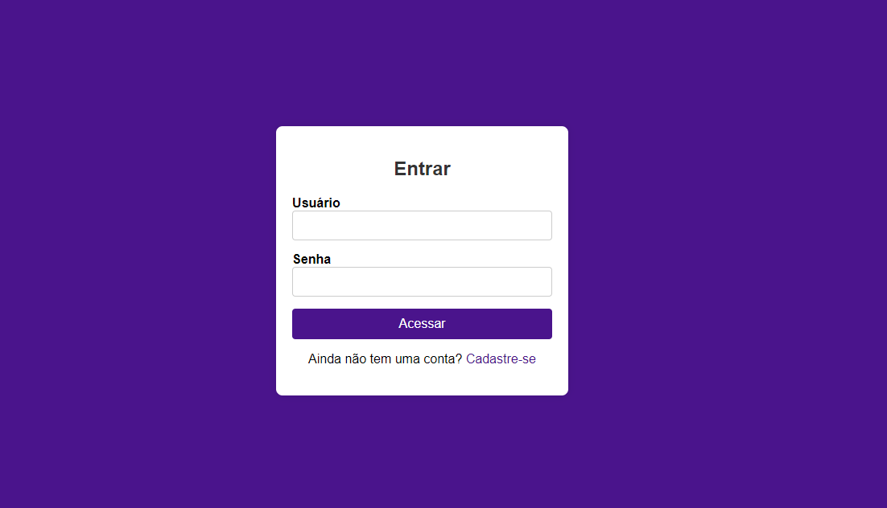

<h1 align="center" style="font-weight: bold;">Sistema de Recrutamento Interno 💻</h1>


- **Autenticação e Autorização:** Sistema seguro de autenticação para usuários com gestão de sessões usando tokens JWT.

- **Cadastro de Vagas:** Administração de vagas com título, descrição detalhada e requisitos necessários. Atualização e exclusão de vagas.

- **Candidatura a Vagas:** Candidatura a vagas específicas com notificações automáticas para candidatos e responsáveis.

## Funcionalidades Bônus

- **Painel do Candidato:** Acompanhamento do status das candidaturas e recebimento de feedbacks automáticos.

- **Avaliação de Candidatos:** Sistema para avaliação de candidatos por responsáveis de vaga, incluindo filtros de requisitos.

<p align="center">
 <a href="#tech">Technologies</a> • 
 <a href="#started">Getting Started</a> • 
  <a href="#colab">Collaborators</a> •
</p>

<p align="center">
    <b>Sistema de Recrutamento Interno, usuário pode se candidatar a diversas vagas criadas pelo recrutador(Admin), o mesmo é responsavel por criar vagas e também pode avaliar o candidato a entrevista.</b>
</p>

<p align="center">
     <a href="https://recrutamento-lime.vercel.app">📱 Acesse o Projeto</a>
</p>

<h2 id="layout">🎨 Layout</h2>

<p align="center">
    
</p>

<h2 id="technologies">💻 Technologies</h2>

### Frontend
- Angular
- Componentes e serviços para interação com o usuário

### Backend
- Java com Spring Boot 2.0
- Spring Security, JWT
- Hibernate/JPA, MySQL


<h2 id="started">🚀 Getting started</h2>

Para rodar o seu projeto localmente é necessário que você já tenha o ambiente configurado com as seguintes ferramentas:

<h3>Pré Requisitos</h3>

- [AngularJS](https://github.com/)
- [Java 17](https://github.com)
- [Maven](https://github.com)

- [MySQL](https://github.com)
- [Docker](https://github.com)
- [Git](https://github.com)

<h3>Clone o Projeto</h3>

Como clonar seu projeto:

```bash
git clone https://github.com/Danylo93/recrutamento-interno.git
```

<h3>Configuração e Execução do Projeto com Docker</h3>


```bash
cd recrutamento-interno
docker-compose up -d
```


<h5>Obs: Caso não tenha o Docker Instalado, siga os passoas abaixo:</h5>

<h3>Configuração e Instalação sem Docker</h3>

Como iniciar seu projeto: 

Frontend:

1. Clone o repositório:

   ```bash
   git clone https://github.com/Danylo93/recrutamento-interno.git
   cd recrutamento-interno
   ```

2. Instale as dependências:
   ```bash
   npm install --force
   ```
3. Ajuste a URL do seu backend em `src/environments/environment.ts`

4. Inicie o servidor de desenvolvimento do Angular:
   ```bash
   ng serve
   ```

Backend:

1. Abra a pasta do backend:

```bash
cd recrutamento-interno
cd backend
```
2. Configure o application.properties com as configurações do seu banco de dados.


3. Inicie a aplicação:
```bash
mvn spring-boot:run
```


<h2 id="colab">🤝 Collaborators</h2>


<table>
  <tr>
    <td align="center">
      <a href="#">
        <br>
        <sub>
          <b>Danylo Oliveira</b>
        </sub>
      </a>
    </td>
  </tr>
</table>

---
